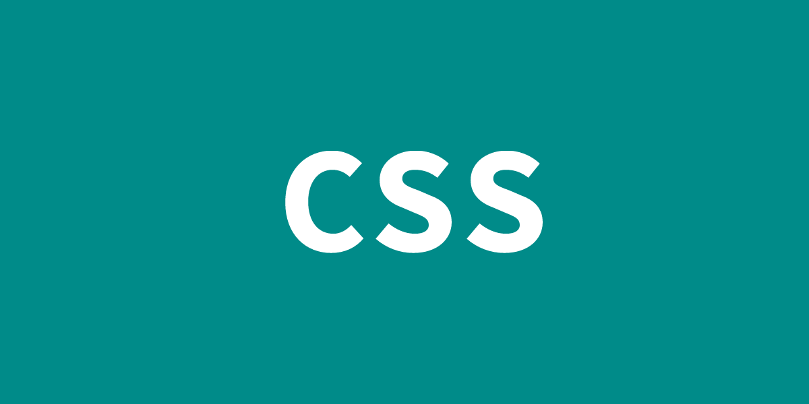

<div class="kv-box">
   
</div>

## CSSとは
[CSS](https://www.w3.org/Style/CSS/)は、本名を"***Cascading Style Sheets***"といいます。  
相棒は***HTML***です。  
HTMLを***文書構造***とすると、CSSは文章の***体裁***や***見た目***です。  
非常に書き易いのですがよくよく考えて書かないと、数ヶ月後には某学園のように様々な問題が発覚したり発生したりします。とても壊れやすくデリケートです。

"***よくよく考えて書かないと*** ..."  
この部分を手助けるCSS設計案を挙げていきます。

## OOCSS
[OOCSS](https://github.com/stubbornella/oocss)は、***Object Oriented CSS***の略です。  
***オブジェクト指向CSS*** と呼ばれています。
- コンテナとコンテンツの分離
- 構造と見た目の分離

という部分が重要となります、bootstrapみたいな感じ。

```
<button class="btn btn-submit">送信</button>
<button class="btn btn-remove">削除</button>
```
```
// base rule
.btn {
   display: block;
   position: relative;
}
// skin
.btn-submit {
   background-color: red;
}
.btn-remove {
   background-color: blue;
}
```

## SMACSS
[SMACSS](https://smacss.com/)は、***Scalable and Modular Architecture for CSS***の略です。  
***Base***, ***Layout***, ***Module***, ***State***, ***Theme*** の5つのレイヤーに分けてUIを組み立てていきます。  
個人的にThemeはModuleに含めて書いても良い場合もあるように感じています。  

- Base：デフォルトスタイル（resetなど）
- Layout：レイアウト
- Moudule：再利用可能なパーツ
- State：LayoutとModuleの状態
- Theme：LayoutとModuleの見た目

## MCSS
[MCSS]()は、[BEM](https://en.bem.info/)とOOCSSの原理を基にしたCSS設計案で、名前は***Multilayer CSS***の略です。  
***Base***, ***Project***, ***Cosmetic***のレイヤーに属するクラスを組み合わせてUIを構築していきます。  
[オリジナルドキュメント ロシア語](http://operatino.github.io/MCSS/)  

- Base：再利用できる基本ルールセット
- Project：Baseを基にした固有のルールセット
- Cosmetic：helper的なもの

## FLOCSS
[FLOCSS](https://github.com/hiloki/flocss)は、OOCSS, SMACSS, MCSS, SuitCSS, BEMの良いところをまとめた、モジュラーなアプローチのCSS設計案です。  
***Foundation***, ***Layout***, ***Object***レイヤーと、 ***Objectレイヤー内の3つの子レイヤー***でUIを構築していきます。  
命名規則は、[MindBEMding](https://csswizardry.com/2013/01/mindbemding-getting-your-head-round-bem-syntax/)を用います。

1. Foundation：reset/normalize/base etc.
1. Layout：header/main/footer etc.
1. Object
	- Component：再利用可能なパーツ
	- Project：そのページ固有のルールなど
	- Utility：helper的なものの集まり

いま私が所属している部署で新規に立ち上げるサービスに関しては、FLOCSSを積極採用するようにしています。

## ECSS
[ECSS](http://ecss.io/)は***Enduring CSS***の略です。  
"Enduring"は、"***長生きする、永続的な、不朽の、我慢強い、辛抱強い***"という意味です。  
2016年くらいから少し話題になってきているようです。  

大規模プロジェクトのためのCSS設計手法で、抽象的なスタイルを個々に分離すること、各ルールがお互いに影響を及ぼさずかつ分離しやすいように設計することが最大の特徴でありゴールのようです。

- [The Ten Commandments of Sane Style Sheets](http://ecss.io/chapter8.html)

なんか制約が多くて最初の導入やメンバー間の認識合わせに時間が掛かりそうな気がします。


## APBCSS
[APBCSS](http://apbcss.com/)は、***Atomic Parts Base CSS***の略です。  
最近導入事例の多い[Atomic Design](http://atomicdesign.bradfrost.com/)の特徴を活かした新しいCSS設計です。  
***Atomic***, ***Module***, ***Skin***, ***Number***, ***State***, ***Other*** の6つのClass Typeに分類して設計します。  

- Atomic：原子パーツ名となるクラス名
- Module：UIを包括するモジュール名となるクラス名
- Skin：装飾などのクラス名
- Number：ナンバリング用のクラス名
- State：状態を表すクラス名
- Other：その他のクラス名。パーツのセマンティックネームもここに含む。

AtomicとModuleを基本とし、Skin、Number、State、Otherを付与クラスとして用いてUIを構築していきます。

個人的に次はこれがくるのではと考えています。

## MindBEMding
FLOCSSで用いられるMindBEMdingはCSSの命名規則です。  
日本でBEMといったら何となくこちらのMindBEMdingを指すことが多いような気がします。  
***Block***, ***Element***, ***Modifier*** の組み合わせてクラス名を作っていきます。  

```
// 基本形
Block__Element--Modifier
```
```
// Block
.Block {
   dislay: block;
}
// ex
.global-navigation {
   dislay: block;
}
```
```
// Element
.Block__Element {
   display: block;
}
// ex
.global-navigation__item {
   dislay: block;
}
```
```
// Modifier
.Block__Element--Modifier {
   display: block;
}
// ex
.global-navigation__item--selected {
   dislay: block;
}
```

## CSS設計のゴール

ここまでいろいろ紹介してきましたが、ECSSとAPBCSSなど新しいものについてはしっかりと内容を追えていないのが正直なところです...  

CSS設計が目指すゴールには、以下の4点が基本的に言われています。
- ***予測しやすい***
- ***保守しやすい***
- ***再利用しやすい***
- ***拡張しやすい***

参照：  
[CSS Architecture 原文](https://philipwalton.com/articles/css-architecture/)  
[CSS Architecture 日本語訳](http://article.enja.io/articles/css-architecture.html)

どのCSS設計案もCSSが抱えている、書き易くも壊れやすく属人化しやすいという問題を解決しようとしていることに変わりはないと思います。  
どのCSS設計案を選択するかは、制作しようとするサービスの規模や特性、メンバーの規模によって十分検討しないといけません。

次々と新しいアプローチが出てくるフロントエンドの世界は動向を追いかけていくのが正直大変です。  
しかし、そういう常に成長していく生き物みたいな部分がやっぱ面白いなと実務をしていてもこうしてブログ書いてても改めて感じます。

何か抜けてる部分があったら加筆します。

CSS ModulesやScoped CSSについてはまた次回。